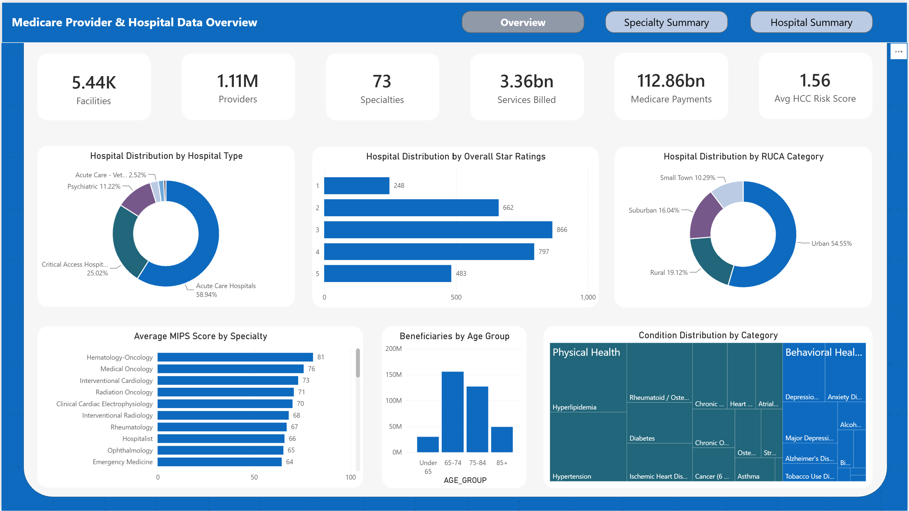
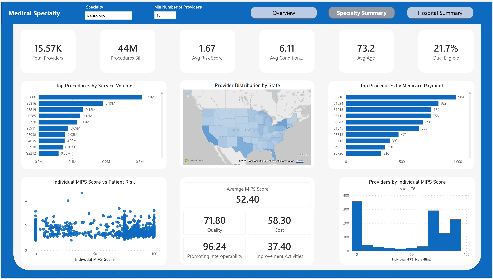
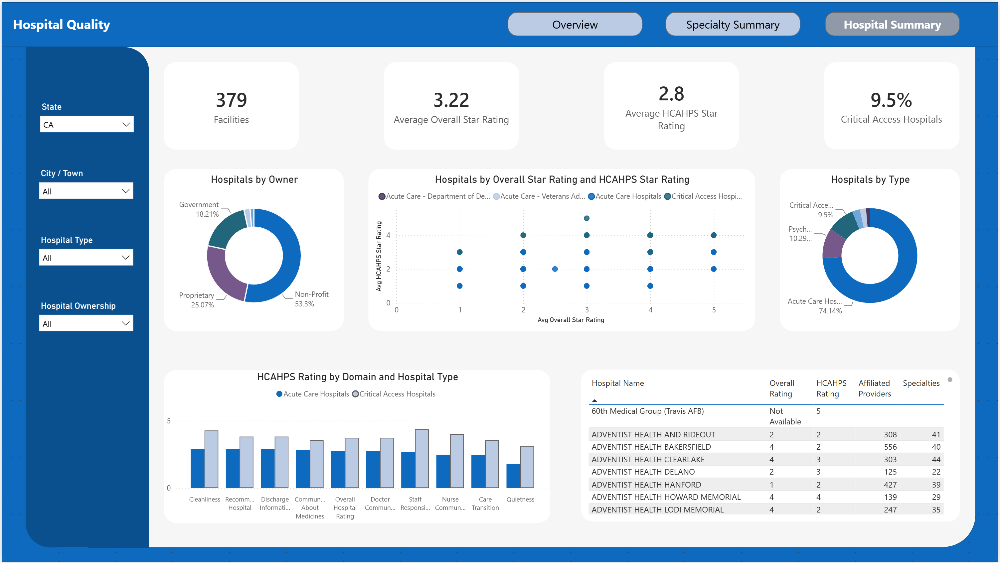

# Medicare Provider & Hospital Quality Analytics Pipeline


[](#)

## Project Overview

This project builds an end-to-end ETL pipeline to analyze Medicare provider and hospital quality data published by the Centers for Medicare and Medicaid Services (CMS). The pipeline extracts data from eleven source files, standardizes column names and data types, and loads the data into Snowflake. The data is then imported into Power BI to create dashboards that highlight provider performance by specialty and hospitals by quality and patient experience.

## Data

All data is publicly available from [CMS Data](https://data.cms.gov/) and the [CMS Provider Data Catalog](https://data.cms.gov). Source files come from multiple CMS archives to ensure all are from the same reporting period. See docs/data_sources.md for the complete list of source files, download locations, and archive selection.

## Pipeline

**Extraction:** raw CMS CSV files downloaded and loaded using Python/pandas
**Transformation:** data cleaning, type standardization, and schema normalization applied before loading
**Loading:** transformed data written to Snowflake via snowflake-connector-python using RSA key pair authentication
**Modeling:** SQL views created in Snowflake to support dashboard requirements
**Visualization:** Power BI dashboard in Import mode with DAX measures and calculated columns

## Schema

See the project [Data Dictionary](docs/data_dictionary.md) for full details about each table.

```mermaid

erDiagram
    PROVIDER_DEMOGRAPHICS ||--o{ PROVIDER_SERVICES: "RNDRNG_NPI"
    PROVIDER_DEMOGRAPHICS ||--o{ PROVIDER_SUMMARY: "RNDRNG_NPI"
    PROVIDER_DEMOGRAPHICS ||--o{ MIPS_PERFORMANCE: "NPI"
    PROVIDER_DEMOGRAPHICS ||--o{ MIPS_METRICS: "NPI"

    HOSPITAL_GENERAL_INFORMATION ||--o{ HOSPITAL_COMPLICATIONS_DEATHS: "FACILITY_ID"
    HOSPITAL_GENERAL_INFORMATION ||--o{ HOSPITAL_UNPLANNED_VISITS: "FACILITY_ID"
    HOSPITAL_GENERAL_INFORMATION ||--o{ HOSPITAL_HAI: "FACILITY_ID"
    HOSPITAL_GENERAL_INFORMATION ||--o{ HOSPITAL_HCAHPS: "FACILITY_ID"

    PROVIDER_HOSPITAL_AFFILIATION }o--|| PROVIDER_DEMOGRAPHICS: "NPI"
    PROVIDER_HOSPITAL_AFFILIATION }o--|| HOSPITAL_GENERAL_INFORMATION: "FACILITY_ID"

    PROVIDER_DEMOGRAPHICS {
        string RNDRNG_NPI PK
    }

    PROVIDER_SERVICES {
        string RNDRNG_NPI PK, FK
        string HCPCS_CD PK
    }

    PROVIDER_SUMMARY {
        string RNDRNG_NPI PK, FK
    }

    MIPS_PERFORMANCE {
        string NPI PK, FK
        string ORG_PAC_ID PK
    }

    MIPS_METRICS {
        string NPI PK, FK
        string MEASURE_CD PK
    }

    HOSPITAL_GENERAL_INFORMATION {
        string FACILITY_ID PK
    }

    HOSPITAL_COMPLICATIONS_DEATHS {
        string FACILITY_ID PK, FK
        string MEASURE_ID PK
    }

    HOSPITAL_UNPLANNED_VISITS {
        string FACILITY_ID PK, FK
        string MEASURE_ID PK
    }

    HOSPITAL_HAI {
        string FACILITY_ID PK, FK
        string MEASURE_ID PK
    }

    HOSPITAL_HCAHPS {
        string FACILITY_ID PK, FK
        string HCAHPS_MEASURE_ID PK
    }

    PROVIDER_HOSPITAL_AFFILIATION {
        string NPI PK
        string FACILITY_AFFILIATIONS_CERTIFICATION_NUMBER PK
    }

    RUCA_ZIP_CODES {
        string ZIPCODE PK
        string PRIMARYRUCA
    }

```



## Dashboard

#### High Level Summary of the Entire Dataset



#### Provider Service and Quality by Medical Specialty



#### Hospital Quality and Patient Experience



## Limitations

- This pipeline uses drop-and-recreate loading and is designed specifically for the 2023 data sets used in the project. Longitudinal analysis of these data sets is not possible with the current configuration.
- CMS does not have a standard reporting period or source for all measures. Data from each measure set is collected in differing time frames, making direct comparison between published sets challenging. Care was taken to ensure the files selected for this project all include the period of time from January to December 2023; however, some measure sets have longer reporting cycles and will include data collected outside that range.

## How To Run

### Prerequisites

- Python 3.14
- Snowflake account with key-pair authentication
- Power Bi Desktop

### Installation

Clone the repository and install requirements.

```bash
git clone https://github.com/Sarah-Eden/medicare-etl.git
cd medicare-etl
pip install -r requirements.txt
```

Configure the database connection, replace environment variables with your credentials.

```bash
copy .env.example .env
```

Download source files from CMS (see [docs/data_sources.md](docs/data_sources.md)) and place them in a `data/` directory.

Run main pipeline to extract and transform data from the CSV files and load it into snowflake.

```bash
python main.py
```

After loading, run `sql/constraints.sql` and `sql/views.sql` in Snowflake to apply keys and create views.
